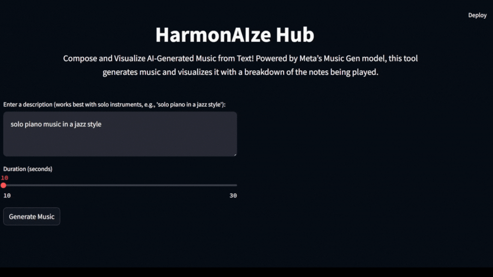

# HarmonAIze Hub

HarmonAIze Hub is a web app that generates music from text descriptions and visualizes the output in a video format. The app uses Meta's MusicGen model from the Audiocraft library to create music and then Fast Fourier Transforms (FFT) are applied to get and visualize the notes being played. As a result, this tends to only work well with solo instrumental music.

Below is a demo as a gif file. Click here to watch it with audio: [video demonstration](media/HarmonAIze_Hub_Video_Example.mp4).



## Features

- **Text-to-Music Generation**: Input a text description to generate music. The app uses the MusicGen model to create music based on the provided description.
- **Music Visualization**: Visualize the generated music with a breakdown of the notes being played using FFT.
- **Video Output**: The app produces a video combining the generated music and its visualization.

## How It Works

1. **Text Input:** The user inputs a text description of the desired music.
2. **Music Generation:** The app uses the MusicGen model to generate music based on the text description.
3. **FFT Analysis:** The generated music is analyzed using FFT to extract frequency information.
4. **Visualization:** The frequency information is visualized, showing the notes being played.
5. **Video Creation:** The visualization frames and the generated music are combined into a video using FFmpeg.

## Installation

### Prerequisites

- Python 3.7 or higher
- [FFmpeg](https://ffmpeg.org/download.html) installed and available in your system's PATH

### Steps

1. Clone the repository:

   ```sh
   git clone https://github.com/yourusername/HarmonAIzeHub.git
   cd HarmonAIzeHub
   ```

2. Initialize and update submodules:

    ```sh
    git submodule init
    git submodule update
    ```

3. Create and activate a virtual environment:

    ```sh
    python -m venv venv
    source venv/bin/activate  # On Windows, use `venv\Scripts\activate`
    ```

4. Install the required dependencies:

    ```sh
    pip install -r requirements.txt
    ```

## Usage

1. Run the Streamlit app:

    ```sh
    streamlit run src/app.py
    ```

2. Open your web browser and navigate to http://localhost:8501.

3. Enter a text description to generate music. For best results, use descriptions that specify solo instruments (e.g., "solo piano in a jazz style").

4. Adjust the duration of the generated music using the slider.

5. Click the "Generate Music" button to create and visualize the music.

## Project Structure

```
HarmonAIzeHub/
├── audiocraft/                # Submodule for Audiocraft library
├── media/                     # Directory for media files
├── src/                       # Source code directory
│   ├── app.py                 # Main Streamlit app
│   ├── visualizer.py          # Music visualization logic
│   └── ...                    # Other source files
├── requirements.txt
└── README.md
```
